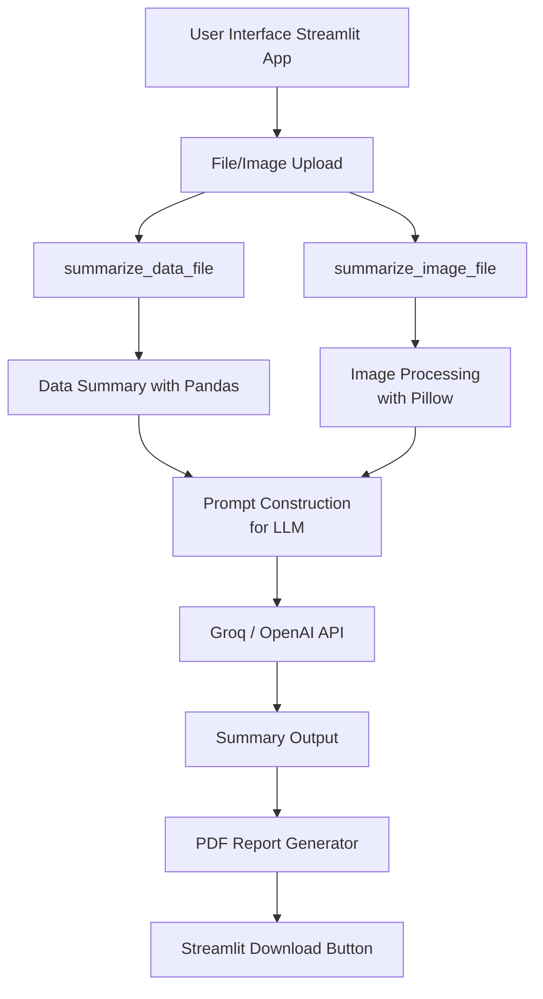

# 📊 Luminalnsights

**Insight Summarizer** is an AI-powered Streamlit application that generates technical and non-technical summaries from both structured data files (like CSV, JSON, Excel) and visual content (charts, graphs, diagrams).  
It’s built for **professors**, **researchers**, and **industry analysts** who want instant, human-friendly insights from data or visuals.

---

## 🌟 Features

- 📁 Supports CSV, JSON, Excel, Parquet, and TXT file uploads  
- 🖼️ Image analysis of charts and diagrams (PNG, JPG, JPEG)  
- 🧠 AI-generated summaries (technical + non-technical)  
- 📄 Export reports as downloadable PDFs  
- 📊 Insight tabs: nulls, duplicates, stats, and more  
- ✅ Streamlit-based responsive UI


## 🧠 Architecture (Mermaid Diagram)



---

## 🧾 Architecture Explanation

### 1. **User Interface (Streamlit App)**

* Users interact with a **clean UI** built with Streamlit, choosing either:

  * A data file (CSV, JSON, Excel, etc.)
  * An image file (PNG, JPG, etc.)

### 2. **Upload Handler**

* Streamlit's `file_uploader` sends the file to either:

  * `summarize_data_file()` — for structured data
  * `summarize_image_file()` — for visual content

### 3. **Processing the Input**

* **Data files** are parsed with **Pandas**, then summarized using `.describe()`, `.isnull()`, `.nunique()`, etc.
* **Image files** are opened using **Pillow** and base64 encoded for model input.

### 4. **Prompt Construction**

* A well-crafted prompt is built for the **LLM (Groq or OpenAI)**:

  * Includes the technical summary (via Pandas)
  * Requests both technical and non-technical explanations

### 5. **LLM API Call**

* The AI model processes the structured prompt and returns a **multi-layered explanation**.

### 6. **Summarization Output**

* The response from the LLM is formatted and displayed to the user:

  * Technical summary
  * Human-friendly summary

### 7. **PDF Report Generator**

* The final summary is converted to a downloadable **PDF** using `fpdf`.

### 8. **Streamlit Download**

* The user can download the PDF version of the summary report directly.

---

## 📦 Integration Summary

| Layer          | Technologies Used  |
| -------------- | ------------------ |
| Frontend       | `Streamlit`        |
| File Handling  | `Pandas`, `Pillow` |
| AI Integration | `Groq` or `OpenAI` |
| PDF Generation | `fpdf`             |
| Image Encoding | `base64`           |

---


## 🚀 Getting Started

### 🔧 Prerequisites

* Python 3.9+
* API key for [Groq](https://groq.com/) (or OpenAI as an alternative)

### 📦 Installation

```bash
git clone https://github.com/Nachiket1904/insight-summarizer.git
cd insight-summarizer

# Install required packages
pip install -r requirements.txt
```

---

## 🖥️ Running the App

```bash
streamlit run app.py (streamlit run app.py --server.port $PORT --server.enableCORS false | for dynamic port mapping according to deployment server )
```

> This will open the app in your browser at `http://localhost:8501`

---

## 🧰 Tech Stack

* [Streamlit](https://streamlit.io/) – UI framework
* [Pandas](https://pandas.pydata.org/) – Data processing
* [Pillow](https://pillow.readthedocs.io/) – Image handling
* [Groq](https://groq.com/) – LLM API (or OpenAI)
* [fpdf](https://py-pdf.github.io/fpdf2/) – PDF export
* \[Openpyxl, Pyarrow] – File format support

---

## 🗂️ Project Structure

```text
insight-summarizer/
│
├── app.py                   # Main Streamlit app
├── requirements.txt         # Project dependencies
├── README.md                # This file
├── utils/
│   └── summaries.py         # Core logic: summarization functions
└── assets/                  # (Optional) For images, logos, etc.
```

---

## 🤝 Contributing

We welcome contributions from the community!

1. Fork the repository
2. Create a new branch (`git checkout -b feature-x`)
3. Commit your changes (`git commit -am 'Add new feature'`)
4. Push to the branch (`git push origin feature-x`)
5. Create a pull request

---

## 📜 License

This project is licensed under the **MIT License**. See `LICENSE` for details.

---

## 🙌 Acknowledgements

* Groq / OpenAI for LLM power
* Streamlit for the smooth frontend
* You – for building intelligent insight tools!


### 📌 Next Steps

- ✅ Add this to your GitHub repo as `README.md`
- 📷 Include a **screenshot** or **GIF** of your app running (optional)
- Add a `LICENSE` file (`MIT` or `Apache-2.0` if open source)
